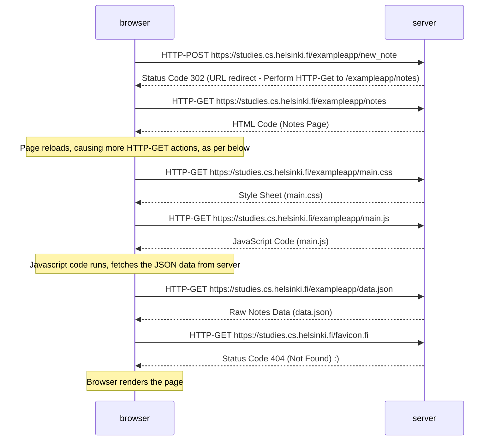

```mermaid
sequenceDiagram
    participant B as browser
    participant S as server

    B->>S: HTTP-POST https://studies.cs.helsinki.fi/exampleapp/new_note
    S-->>B: Status Code 302 (URL redirect - Perform HTTP-Get to /exampleapp/notes)

    B->>S: HTTP-GET https://studies.cs.helsinki.fi/exampleapp/notes
    S-->>B: HTML Code (Notes Page)

    Note over B: Page reloads, causing more HTTP-GET actions, as per below

    B->>S: HTTP-GET https://studies.cs.helsinki.fi/exampleapp/main.css
    S-->>B: Style Sheet (main.css)

    B->>S: HTTP-GET https://studies.cs.helsinki.fi/exampleapp/main.js
    S-->>B: JavaScript Code (main.js)

    Note over B: Javascript code runs, fetches the JSON data from server

    B->>S: HTTP-GET https://studies.cs.helsinki.fi/exampleapp/data.json
    S-->>B: Raw Notes Data (data.json)

    B->>S: HTTP-GET https://studies.cs.helsinki.fi/favicon.fi
    S-->>B: Status Code 404 (Not Found) :)

    Note over B: Browser renders the page

```
