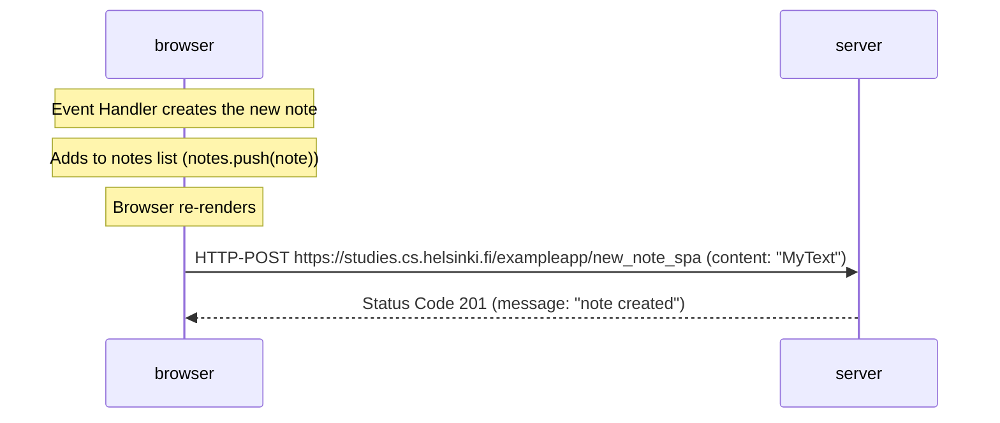

```mermaid
sequenceDiagram
  participant B as browser
  participant S as server

  Note over B: Event Handler creates the new note
  Note over B: Adds to notes list (notes.push(note))
  Note over B: Browser re-renders

  B->>S: HTTP-POST https://studies.cs.helsinki.fi/exampleapp/new_note_spa (content: "MyText")
  S-->>B: Status Code 201 (message: "note created")

```
